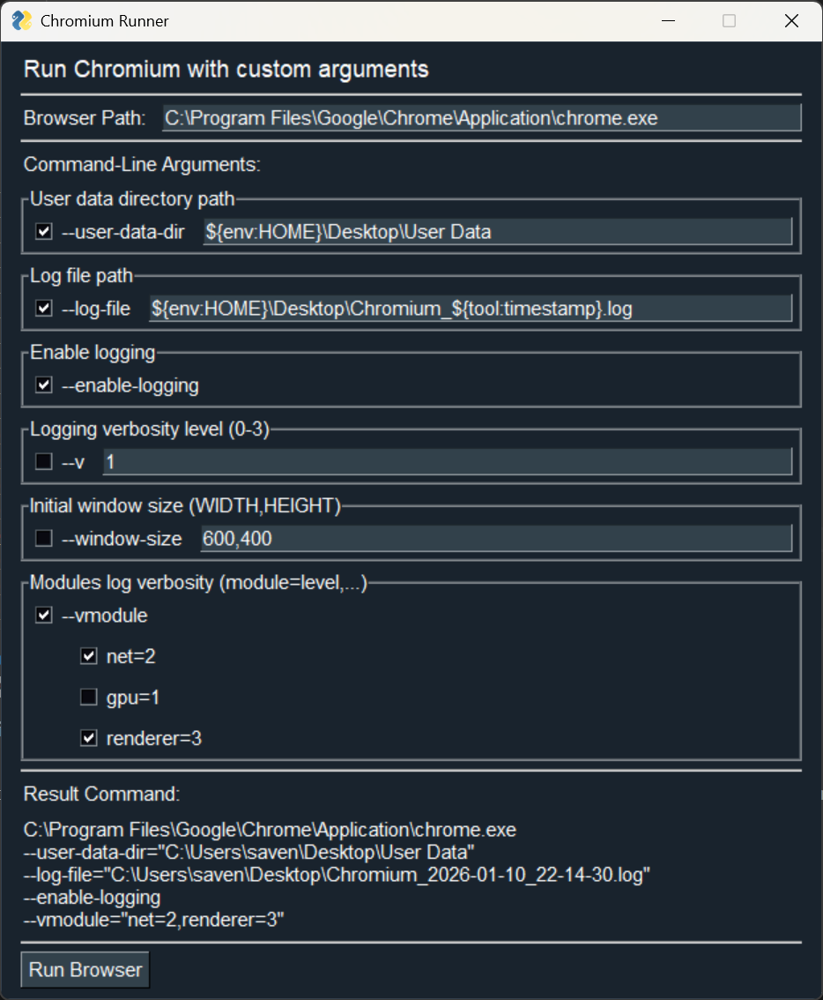

# 🚀 ChromiumRunner

<div align="center">

**A tool for launching Chromium-based browsers with dynamic GUI and custom command-line arguments**

[](https://www.python.org/)
[](LICENSE)
<!-- [](https://github.com/SavenkovIgor/ChromiumRunner) -->



</div>

## What it does

Launch Chrome, Edge, Brave, or other Chromium browsers with specific flags and
arguments without typing long command lines every time.

Under the hood, it takes a JSON config file defining the browser path and arguments
and generates a GUI for this argument list with checkboxes, text inputs, and stuff.

### Features

- ✅ Enable/disable browser flags with checkboxes
- 📝 Support for flags, strings, numbers, and list arguments
- 💾 Settings saved in JSON config files
- 🔧 Environment variables (`${env:VAR}`) and timestamps (`${tool:timestamp}`)
- 👁️ Preview the full command before running

### Setup and Running

With source code:

```bash
# Clone the repository
git clone https://github.com/SavenkovIgor/ChromiumRunner.git
cd ChromiumRunner

# And run the application directly:
./main.py

# Or using UV:
uv run main.py
```

## ⚙️ Configuration

Configuration files are JSON files in the application directory.

### Config File Example

```json
{
  "browser_path": "C:\\Program Files\\Google\\Chrome\\Application\\chrome.exe",
  "args": [
    {
        "name": "enable-logging",
        "description": "Enable logging",
        "type": "flag",
        "value": null,
        "enabled": true
    },
    {
      "name": "log-file",
      "description": "Path to the log file",
      "type": "string",
      "value": "${env:HOME}\\Desktop\\Chromium_${tool:timestamp}.log",
      "enabled": true
    }
  ]
}
```

### Argument Types

| Type | Description | Example |
| ---- | ----------- | ------- |
| `flag` | Simple boolean flag | `--disable-web-security` |
| `string` | Text value | `--user-data-dir="/path/to/profile"` |
| `number` | Numeric value | `--window-size=1920` |
| `list` | Comma-separated values | `--enable-features="WebGPU,Feature2"` |

### Value Interpolation

Dynamic values supported:

- **Environment Variables**: `${env:VARIABLE_NAME}`
- **Timestamp**: `${tool:timestamp}` (format: `YYYY-MM-DD_HH-MM-SS`)
- **Escaping**: Use `\${...}` for literal text

**Example:**

```json
{
  "name": "user-data-dir",
  "type": "string",
  "value": "${env:TEMP}\\chrome-${tool:timestamp}"
}
```

## 🛠️ Tech Stack

- Python 3.14
- [UV](https://github.com/astral-sh/uv) for dependency management
- [FreeSimpleGUI](https://github.com/spyoungtech/FreeSimpleGUI)
- PyInstaller for building

## 📦 Building

```bash
./build.py
```

Output: `dist/ChromiumRunner.exe`
